# LangGraph Multi-Agent 아키텍처

## 전체 시스템 아키텍처

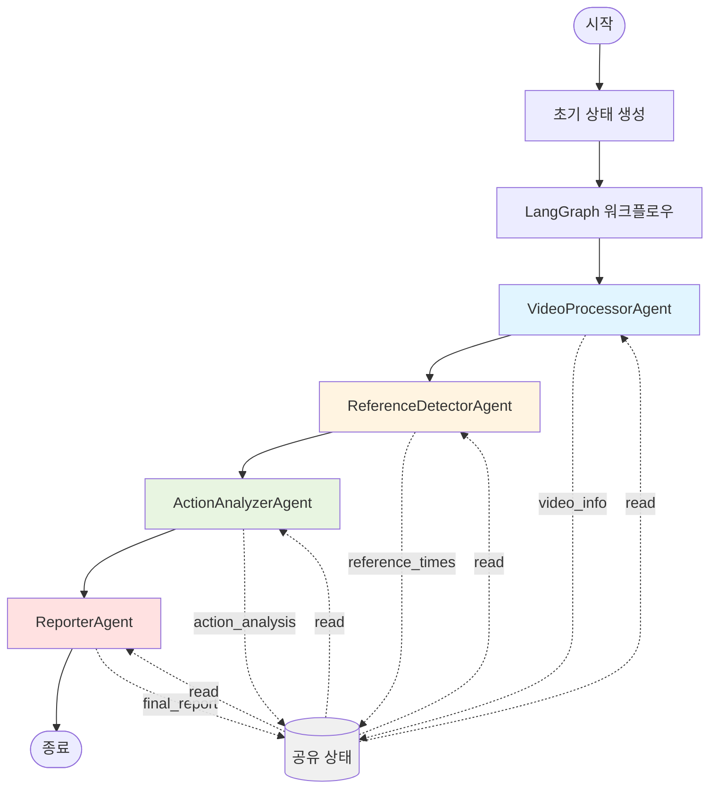

## Agent 상세 구조

### 1. VideoProcessorAgent

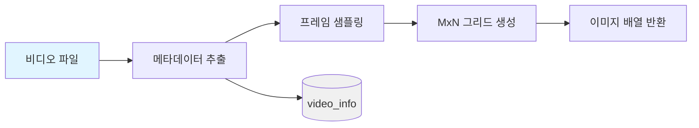

**입력:**
- video_path (비디오 파일 경로)

**출력:**
- video_info (이름, 재생시간, 프레임수, 해상도, 파일크기)

**주요 메서드:**
- `process(state)`: 비디오 정보 추출
- `extract_frames(...)`: 프레임 추출 및 그리드 생성

### 2. ReferenceDetectorAgent

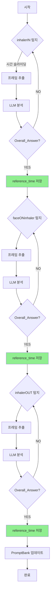

**입력:**
- video_path
- video_info (play_time)

**출력:**
- reference_times (inhalerIN, faceONinhaler, inhalerOUT)
- q_answers_accumulated (Q&A 결과)
- promptbank_data (PromptBank 전체 데이터)

**주요 메서드:**
- `process(state)`: 모든 기준 시점 탐지
- `_detect_inhaler_in()`: inhalerIN 탐지
- `_detect_face_on_inhaler()`: faceONinhaler 탐지
- `_detect_inhaler_out()`: inhalerOUT 탐지
- `_search_reference_time()`: 시간 슬라이딩 탐색

### 3. ActionAnalyzerAgent

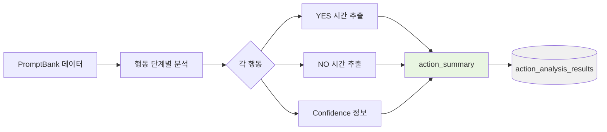

**입력:**
- promptbank_data

**출력:**
- action_analysis_results (행동별 요약)

**주요 메서드:**
- `process(state)`: 행동 분석 실행
- `_create_action_summary()`: 행동 요약 생성

### 4. ReporterAgent

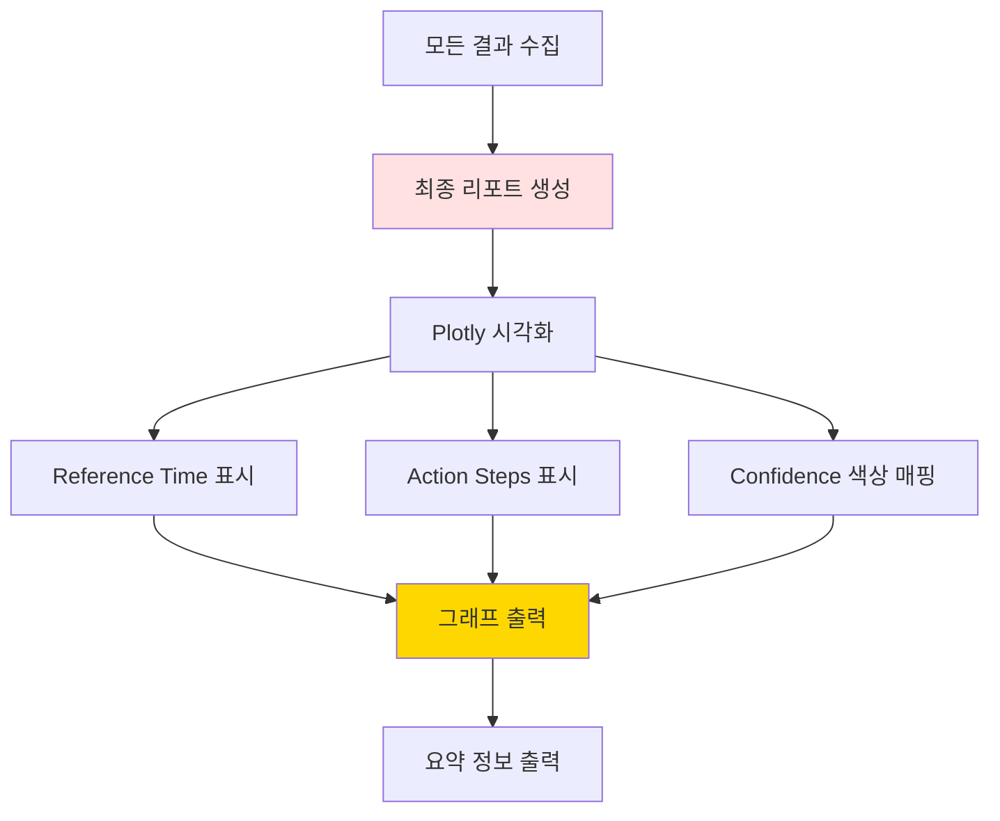

**입력:**
- video_info
- reference_times
- action_analysis_results
- promptbank_data

**출력:**
- final_report (최종 리포트)
- visualization_path (시각화 결과)

**주요 메서드:**
- `process(state)`: 리포트 생성 실행
- `_create_final_report()`: 최종 리포트 생성
- `_create_visualization()`: Plotly 시각화
- `_print_summary()`: 요약 정보 출력

## 상태(State) 관리

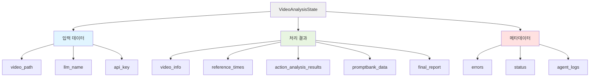

### 상태 필드 설명

| 필드 | 타입 | 설명 |
|------|------|------|
| `video_path` | str | 비디오 파일 경로 |
| `llm_name` | str | LLM 모델 이름 |
| `api_key` | str | OpenAI API 키 |
| `video_info` | Dict | 비디오 메타데이터 |
| `reference_times` | Dict | 기준 시간들 |
| `reference_detection_results` | Dict | 탐지 결과 |
| `action_analysis_results` | Dict | 행동 분석 결과 |
| `q_answers_accumulated` | Dict | Q&A 누적 결과 |
| `promptbank_data` | Dict | PromptBank 데이터 |
| `final_report` | Dict | 최종 리포트 |
| `visualization_path` | str | 시각화 경로 |
| `errors` | List[str] | 오류 목록 |
| `status` | str | 현재 상태 |
| `agent_logs` | List[Dict] | Agent 로그 |

## 워크플로우 실행 흐름

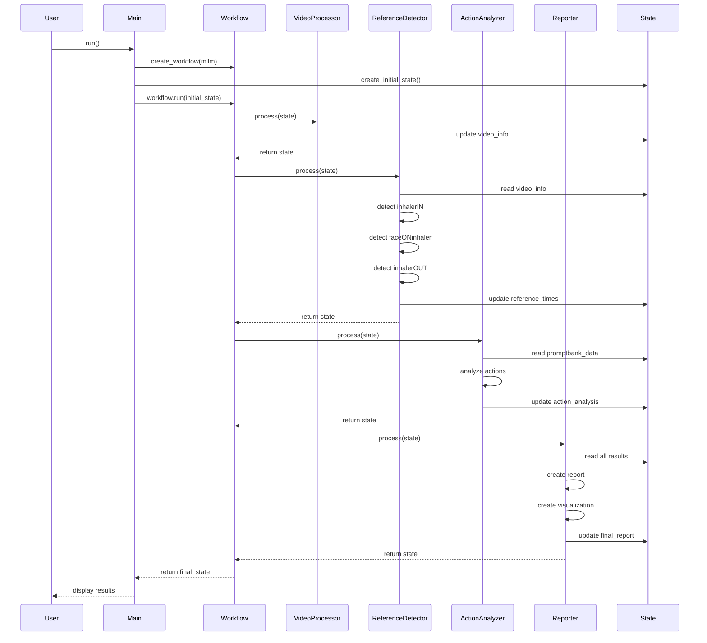

## 데이터 흐름

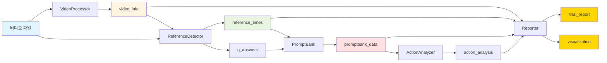

## 확장 가능성

### 병렬 처리 예제

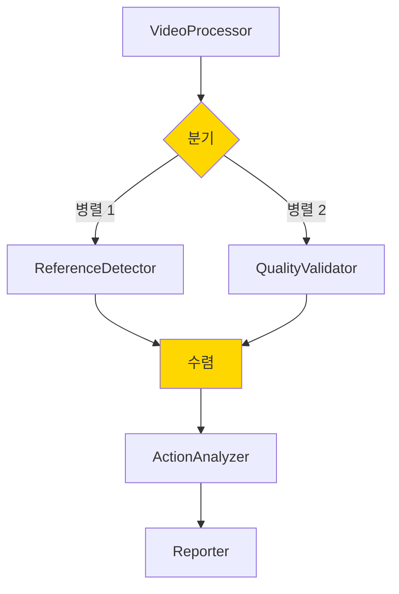

### 새로운 Agent 추가

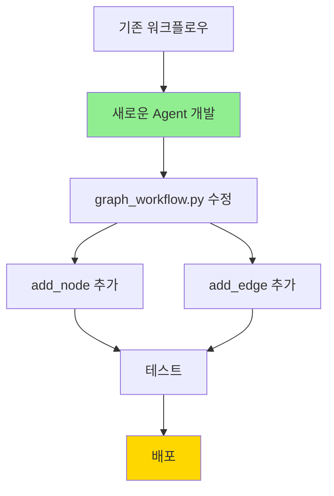

## 오류 처리 메커니즘

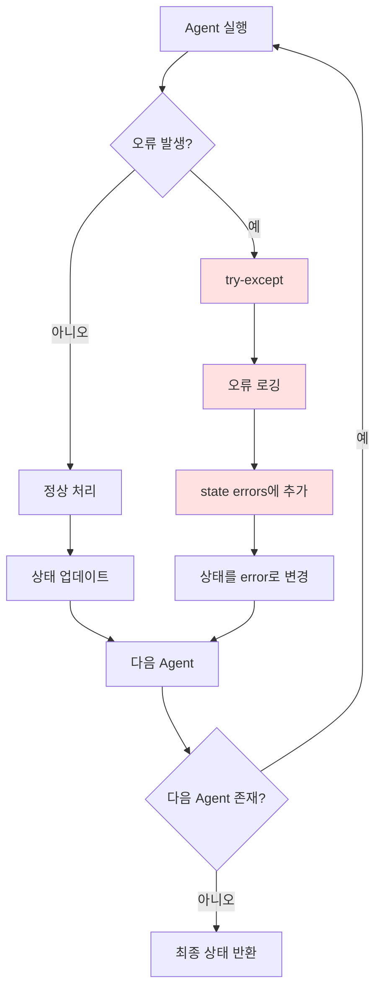

## 성능 최적화 포인트

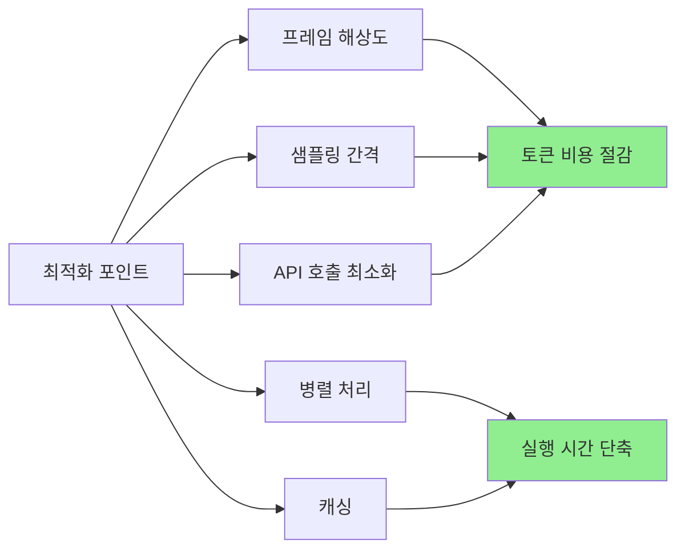

## 테스트 전략

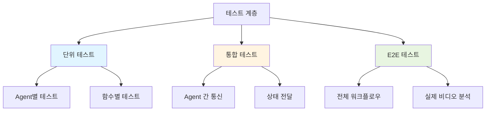

---

이 아키텍처는 확장 가능하고 유지보수가 용이한 구조로 설계되었습니다.

