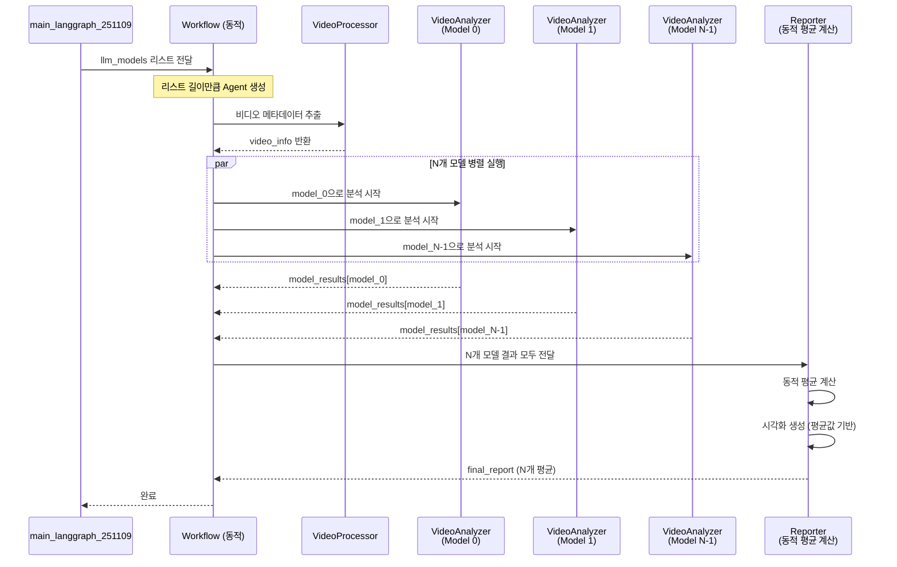

# 동적 멀티모델 병렬 처리 아키텍처

## 개요

이 시스템은 **동적 LLM 모델 리스트**를 기반으로 여러 모델을 병렬 실행하여 비디오 분석의 정확도와 robustness를 향상시킵니다. 모델 개수와 종류를 리스트로 지정하기만 하면 자동으로 병렬 실행되고 결과가 평균화됩니다.

## 핵심 개념

### 1. 동적 모델 리스트

```python
# 코드에서 간단히 리스트로 지정
llm_models = ["gpt-4o-mini", "gpt-4o-mini", "gpt-4o"]  # 3개 모델
llm_models = ["gpt-4o"] * 5  # 동일 모델 5번
llm_models = ["gpt-4o"]  # 1개 모델
```

### 2. 동적 Agent 생성

리스트 길이만큼 자동으로 `VideoAnalyzerAgent` 인스턴스 생성

### 3. 동적 평균 계산

N개 모델의 결과를 자동으로 평균 계산

## 동적 병렬 실행 플로우



## 동적 State 구조

```python
VideoAnalysisState = {
    # 입력 (병렬 실행 시 첫 번째 값 유지)
    "video_path": Annotated[str, keep_first],
    "llm_name": Annotated[str, keep_first],
    "llm_models": Annotated[List[str], keep_first],  # 모델 리스트
    "api_key": Annotated[str, keep_first],

    # 비디오 정보 (병렬 실행 시 첫 번째 값 유지)
    "video_info": Annotated[Dict, keep_first],

    # 동적 모델별 결과 (병렬 실행 시 딕셔너리 병합)
    "model_results": Annotated[Dict[str, Dict[str, Any]], operator.or_],
    # {
    #     "gpt-4o_0": {
    #         "reference_times": {...},
    #         "action_analysis_results": {...},
    #         "q_answers_accumulated": {...},
    #         "promptbank_data": {...}
    #     },
    #     "gpt-4o-mini_1": {...},
    #     "gpt-4o_2": {...}
    # }

    # 평균 결과 (Reporter Agent가 계산)
    "reference_times_avg": Annotated[Dict[str, float], keep_non_none],
    "promptbank_data_avg": Annotated[Dict, keep_non_none],

    # 최종 결과
    "final_report": Annotated[Dict, keep_non_none],
    "visualization_path": Annotated[str, keep_non_none],

    # 메타데이터
    "errors": Annotated[List[str], operator.add],
    "status": Annotated[str, keep_non_none],
    "agent_logs": Annotated[List[Dict], operator.add]
}
```

### Reducer 함수 설명

```python
def keep_first(left: Any, right: Any) -> Any:
    """병렬 실행 시 첫 번째 유효한 값 유지"""
    # 입력 정보는 첫 번째 Agent의 값 유지
    # video_path, llm_models 등에 사용

def keep_non_none(left: Any, right: Any) -> Any:
    """병렬 실행 시 None이 아닌 값 우선"""
    # Reporter Agent의 결과는 최신 값 유지
    # reference_times_avg, final_report 등에 사용

def operator.or_(left: Dict, right: Dict) -> Dict:
    """병렬 실행 시 딕셔너리 병합"""
    # model_results 딕셔너리 병합
    # {**left, **right}
```

## 동적 워크플로우 생성

### graph_workflow.py

```python
class InhalerAnalysisWorkflow:
    def __init__(self, mllm_instances: list, llm_models: list):
        """
        리스트로 받은 모델들을 동적으로 Agent 생성
        """
        self.mllm_instances = mllm_instances
        self.llm_models = llm_models
        
        self.video_processor = VideoProcessorAgent()
        
        # 동적으로 VideoAnalyzerAgent 생성
        self.video_analyzers = []
        self.analyzer_nodes = {}
        for idx, (mllm, model_name) in enumerate(zip(mllm_instances, llm_models)):
            model_id = f"{model_name}_{idx}"  # 고유 ID
            analyzer = VideoAnalyzerAgent(
                mllm, 
                self.video_processor, 
                model_id,  # 동적 ID
                model_name  # 모델 이름
            )
            self.video_analyzers.append(analyzer)
            self.analyzer_nodes[model_id] = analyzer
        
        self.reporter = ReporterAgent()
        self.workflow = self._create_workflow()
        self.app = self.workflow.compile()
    
    def _create_workflow(self):
        """동적으로 노드 생성"""
        workflow = StateGraph(VideoAnalysisState)
        
        # 1. VideoProcessor 노드
        workflow.add_node("video_processor", self._video_processor_node)
        
        # 2. 동적으로 VideoAnalyzer 노드들 추가
        for model_id, analyzer in self.analyzer_nodes.items():
            node_name = f"video_analyzer_{model_id}"
            workflow.add_node(node_name, self._create_analyzer_node(analyzer, model_id))
        
        # 3. Reporter 노드
        workflow.add_node("reporter", self._reporter_node)
        
        # 엣지 추가 (병렬 실행)
        workflow.set_entry_point("video_processor")
        
        # video_processor -> 모든 analyzer (병렬)
        for model_id in self.analyzer_nodes.keys():
            node_name = f"video_analyzer_{model_id}"
            workflow.add_edge("video_processor", node_name)
        
        # 모든 analyzer -> reporter
        for model_id in self.analyzer_nodes.keys():
            node_name = f"video_analyzer_{model_id}"
            workflow.add_edge(node_name, "reporter")
        
        workflow.add_edge("reporter", END)
        
        return workflow
```

## 동적 평균 계산 로직

### reporter_agent.py

```python
def _compute_average(self, state: VideoAnalysisState) -> dict:
    """
    여러 모델의 결과를 동적으로 평균내기
    """
    model_results = state.get("model_results", {})
    num_models = len(model_results)
    
    print(f"[ReporterAgent] {num_models}개 모델의 결과를 평균 계산 중...")
    
    # Reference Time 평균
    reference_times_avg = {}
    for ref_key in ["inhalerIN", "faceONinhaler", "inhalerOUT"]:
        values = []
        for model_id, result in model_results.items():
            ref_times = result.get("reference_times", {})
            if ref_key in ref_times:
                values.append(ref_times[ref_key])
        
        # N개 모델의 평균
        reference_times_avg[ref_key] = round(sum(values) / len(values), 1) if values else 0
    
    # PromptBank 데이터 평균
    # 모든 모델의 check_action_step_common 데이터 수집
    for action_key in all_action_keys:
        all_times_scores = {}  # {time: [(score, confidence), ...]}
        
        for model_id, result in model_results.items():
            promptbank = result.get("promptbank_data", {})
            check_action = promptbank.get("check_action_step_common", {})
            
            if action_key in check_action:
                times = action_data.get('time', [])
                scores = action_data.get('score', [])
                confidences = dict(action_data.get('confidence_score', []))
                
                for i, t in enumerate(times):
                    if t not in all_times_scores:
                        all_times_scores[t] = []
                    all_times_scores[t].append((scores[i], confidences.get(t, 0.5)))
        
        # 각 시간에 대해 평균 계산
        for t in sorted(all_times_scores.keys()):
            score_conf_list = all_times_scores[t]
            scores = [sc[0] for sc in score_conf_list]
            confidences = [sc[1] for sc in score_conf_list]
            
            avg_score = sum(scores) / len(scores)
            avg_confidence = sum(confidences) / len(confidences)
            
            # 0.5 기준으로 반올림
            final_score = 1 if avg_score >= 0.5 else 0
```

## 사용 예제

### 1개 모델

```python
llm_models = ["gpt-4o"]
```

### 2개 모델

```python
llm_models = ["gpt-4o", "gpt-4o-mini"]
```

### 3개 모델 (중복 가능)

```python
llm_models = ["gpt-4o-mini", "gpt-4o-mini", "gpt-4o"]
```

### N개 동일 모델 (일관성 검증)

```python
llm_models = ["gpt-4o"] * 5  # gpt-4o 5번 실행
```

## 장점

### 1. 유연성
- 코드 수정 없이 리스트만 변경
- 1개부터 N개까지 자유로운 모델 개수
- 모델 중복 사용 가능

### 2. 확장성
- 새로운 모델 추가가 용이
- 동적 노드 생성으로 확장 가능

### 3. 정확도
- 여러 모델의 평균으로 안정적인 결과
- 동일 모델 여러 번 실행으로 일관성 검증 가능

### 4. 효율성
- 모든 모델이 병렬로 실행
- 동적 평균 계산으로 추가 코드 불필요

## 성능 고려사항

### 모델 개수에 따른 실행 시간

| 모델 개수 | 예상 시간 (분) | 정확도 | 권장 사용 |
|----------|--------------|--------|----------|
| 1개 | 3-5 | ⭐⭐⭐ | 빠른 테스트 |
| 2개 | 3-5 | ⭐⭐⭐⭐ | 균형 |
| 3개 | 3-5 | ⭐⭐⭐⭐⭐ | 정확도 우선 |
| 5개 | 3-5 | ⭐⭐⭐⭐⭐ | 최고 정확도 |

**Note**: 병렬 실행으로 모델 개수가 늘어나도 실행 시간은 거의 동일

### 비용 고려사항

- OpenAI API 비용은 모델 개수에 비례
- 빠른 모델(gpt-4o-mini) 여러 개 vs 느린 모델(gpt-4o) 1개 비교 가능

## 모범 사례

### 개발 단계
```python
llm_models = ["gpt-4o-mini"]  # 빠르고 저렴
```

### 테스트 단계
```python
llm_models = ["gpt-4o-mini", "gpt-4o"]  # 균형
```

### 프로덕션 단계
```python
llm_models = ["gpt-4o", "gpt-4o", "gpt-4o"]  # 정확도 우선
```

### 일관성 검증
```python
llm_models = ["gpt-4o"] * 5  # 동일 모델 5번 실행
```

---

**마지막 업데이트**: 2024.11.13  
**버전**: 2.0 (동적 모델 지원)
