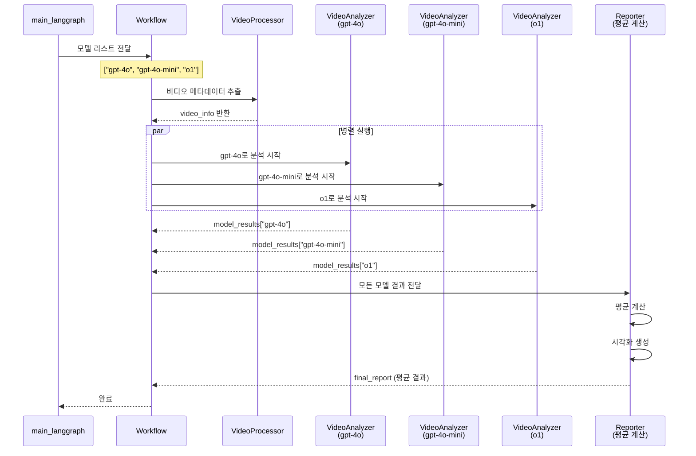

# 멀티모델 병렬 처리 아키텍처

## 개요

이 시스템은 여러 LLM 모델을 병렬로 실행하여 비디오 분석의 정확도와 robust성을 향상시킵니다.

## 멀티모델 병렬 실행 플로우



## State 구조 (멀티모델)

```python
VideoAnalysisState = {
    "video_path": str,
    "llm_models": List[str],  # ["gpt-4o", "gpt-4o-mini", "o1"]
    "api_key": str,
    
    "video_info": {
        "video_name": str,
        "play_time": float,
        "frame_count": int,
        ...
    },
    
    # 모델별 결과 저장
    "model_results": {
        "gpt-4o": {
            "reference_times": {
                "inhalerIN": float,
                "faceONinhaler": float,
                "inhalerOUT": float
            },
            "action_analysis_results": {...},
            "q_answers_accumulated": {...},
            "promptbank_data": {...}
        },
        "gpt-4o-mini": {...},
        "o1": {...}
    },
    
    # 평균 결과
    "final_report": {
        "video_info": {...},
        "model_count": int,
        "models": List[str],
        "averaged_reference_times": {
            "inhalerIN": float,  # 평균값
            "faceONinhaler": float,
            "inhalerOUT": float
        },
        "individual_model_results": {
            "gpt-4o": {...},
            "gpt-4o-mini": {...},
            "o1": {...}
        }
    }
}
```

## 평균 계산 로직

### Reference Time 평균

```python
avg_reference_times = {}
for ref_key in ["inhalerIN", "faceONinhaler", "inhalerOUT"]:
    times = [
        model_data["reference_times"][ref_key]
        for model_data in model_results.values()
    ]
    avg_reference_times[ref_key] = np.mean(times)
```

### Action Step 평균

모든 모델의 action step 결과를 수집하여:
1. 시간대별로 그룹화
2. Score와 Confidence 평균 계산
3. 통합된 결과 생성

## 시각화

### 멀티모델 결과 표시

```
Timeline:
  ┌─────────────────────────────────────────┐
  │ inhalerIN                                │
  ├─────────────────────────────────────────┤
  │  ○ gpt-4o: 2.1s                         │
  │  ○ gpt-4o-mini: 2.3s                    │
  │  ○ o1: 2.0s                             │
  │  ◆ AVG: 2.13s (다이아몬드 마커, 굵은 선)  │
  ├─────────────────────────────────────────┤
  │ faceONinhaler                           │
  ├─────────────────────────────────────────┤
  │  ○ gpt-4o: 5.5s                         │
  │  ○ gpt-4o-mini: 5.8s                    │
  │  ○ o1: 5.4s                             │
  │  ◆ AVG: 5.57s                           │
  └─────────────────────────────────────────┘
```

## 확장성

### 모델 추가

새로운 모델을 추가하려면 `main_langgraph_251109.py`에서:

```python
# 기존
llm_models = ["gpt-4o", "gpt-4o-mini", "o1"]

# 새 모델 추가
llm_models = ["gpt-4o", "gpt-4o-mini", "o1", "claude-3-opus"]

# 나머지 코드는 변경 불필요 - 자동으로 병렬 실행됨
```

### 가중 평균 (향후 개선)

모델별로 신뢰도 가중치 적용:

```python
weights = {
    "gpt-4o": 0.5,
    "gpt-4o-mini": 0.3,
    "o1": 0.2
}

weighted_avg = sum(
    model_results[model]["reference_times"][key] * weights[model]
    for model in llm_models
)
```

## 장점

1. **정확도 향상**
   - Ensemble 효과로 개별 모델 오류 상쇄
   - 여러 모델의 강점을 통합

2. **Robustness**
   - 한 모델이 실패해도 다른 모델 결과 활용
   - 특정 모델의 편향 제거

3. **비교 분석**
   - 모델별 성능 비교 가능
   - 최적 모델 조합 발견 가능

4. **확장성**
   - 새로운 모델 추가 용이
   - 코드 변경 최소화

## 성능 최적화

### 병렬 실행

LangGraph의 병렬 실행 기능으로:
- 각 모델이 독립적으로 실행
- 전체 실행 시간 = max(각 모델 실행 시간)

### 메모리 관리

- 각 VideoAnalyzer는 독립적인 PromptBank 인스턴스 사용
- 프레임은 필요시에만 추출 (캐싱 없음)

### API 비용

- 멀티모델 사용으로 API 호출 증가
- 하지만 정확도 향상으로 재분석 비용 감소
- 비용 vs 품질 트레이드오프

## 사용 예제

```python
# 멀티모델 초기화
llm_models = ["gpt-4o", "gpt-4o-mini", "o1"]
mllms = {
    model: mLLM.multimodalLLM(llm_name=model, api_key=api_key)
    for model in llm_models
}

# 워크플로우 실행
workflow = create_workflow(mllms)
final_state = workflow.run(initial_state)

# 결과 확인
print(f"분석 모델: {final_state['final_report']['models']}")
print(f"평균 inhalerIN: {final_state['final_report']['averaged_reference_times']['inhalerIN']:.2f}초")

# 모델별 비교
for model in llm_models:
    result = final_state['model_results'][model]
    print(f"{model} inhalerIN: {result['reference_times']['inhalerIN']:.2f}초")
```

